# 01 - Data Model & Persistence

Derived from source only (`prisma/schema.prisma`, `src/db.ts`, `src/settings*.ts`, `src/users/*`, `src/seed.ts`, `src/sql-dump.ts`, `src/scripts/db-import.ts`, plus the constants they point at).

## 1. Purpose & scope

ApplyPack keeps everything in one PostgreSQL 16 database (33 tables, 7 enums) accessed through an ORM. The model separates a **shared catalog** (sources/companies and the job postings they yield) from **per-person data** (inbox state, searches, resumes, comparisons, letters, packs, destinations, settings), and from **install-wide** state (a singleton settings row, run history, AI-call ledger). This document covers the schema, how settings are layered (install vs person), multi-user ownership rules, retention, seeding, and the SQL-dump import path. Behaviour of fetchers, classifier, resume AI and notifications is covered elsewhere; only the data they read/write is described here.

Core design ideas worth keeping in a rewrite:

1. **Posting is shared, relationship is personal.** `Job` is global (one row per `(source, externalId)`); `UserJob` carries each person's score, status, alert stamps, application tracking.
2. **Settings are a singleton + a per-user row**, each with JSON "blobs" validated by a schema on read (bad JSON falls back to defaults, never throws).
3. **Soft references for history.** Ledgers (AI calls, packs) deliberately have no foreign keys so history outlives deleted jobs/resumes.
4. **Races are resolved by unique keys + one retry**, and set-wide invariants by a global write lock on the settings row.

## 2. Architecture diagrams

### 2.1 Persistence layer components

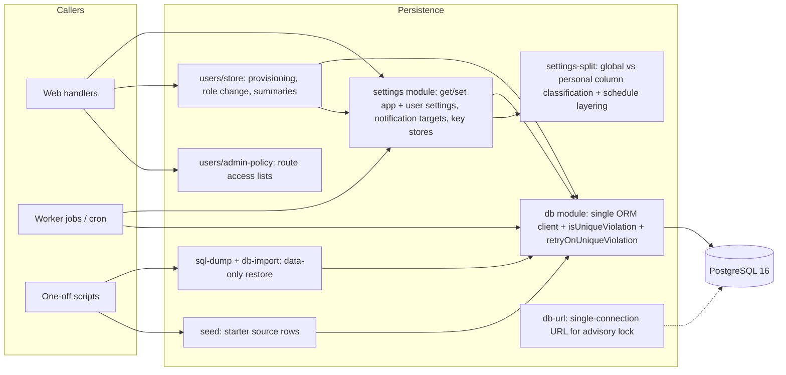
```mermaid
flowchart LR
  subgraph Callers
    WEB[Web handlers]
    WRK[Worker jobs / cron]
    CLI[One-off scripts]
  end
  subgraph Persistence
    DB[db module: single ORM client + isUniqueViolation + retryOnUniqueViolation]
    SET[settings module: get/set app + user settings, notification targets, key stores]
    SPLIT[settings-split: global vs personal column classification + schedule layering]
    USR[users/store: provisioning, role change, summaries]
    POL[users/admin-policy: route access lists]
    SEED[seed: starter source rows]
    DUMP[sql-dump + db-import: data-only restore]
    URL[db-url: single-connection URL for advisory lock]
  end
  PG[(PostgreSQL 16)]
  WEB --> SET
  WEB --> USR
  WEB --> POL
  WRK --> SET
  WRK --> DB
  SET --> DB
  SET --> SPLIT
  USR --> DB
  USR --> SET
  SEED --> DB
  CLI --> DUMP
  CLI --> SEED
  DUMP --> DB
  DB --> PG
  URL -.-> PG
```

### 2.2 ER: sources and jobs (shared catalog)

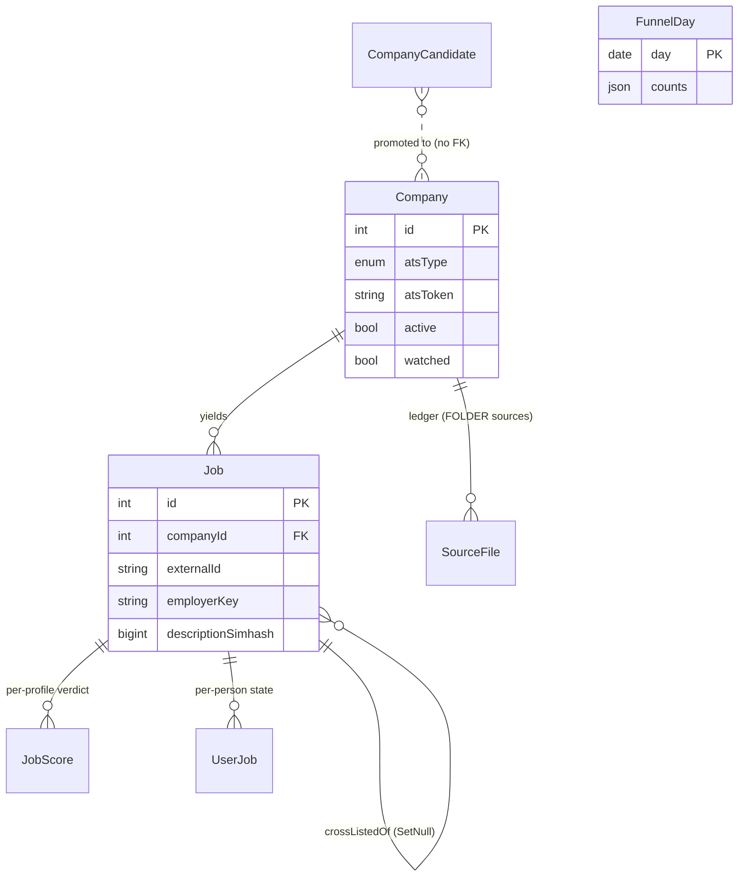
```mermaid
erDiagram
  Company ||--o{ Job : "yields"
  Company ||--o{ SourceFile : "ledger (FOLDER sources)"
  Job ||--o{ Job : "crossListedOf (SetNull)"
  Job ||--o{ JobScore : "per-profile verdict"
  Job ||--o{ UserJob : "per-person state"
  CompanyCandidate }o..o{ Company : "promoted to (no FK)"
  FunnelDay {
    date day PK
    json counts
  }
  Company {
    int id PK
    enum atsType
    string atsToken
    bool active
    bool watched
  }
  Job {
    int id PK
    int companyId FK
    string externalId
    string employerKey
    bigint descriptionSimhash
  }
```

### 2.3 ER: users and settings

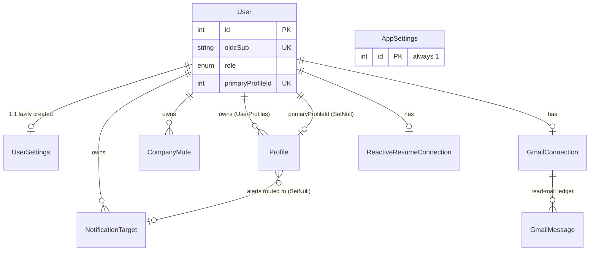
```mermaid
erDiagram
  User ||--o| UserSettings : "1:1 lazily created"
  User ||--o{ Profile : "owns (UserProfiles)"
  User ||--o| Profile : "primaryProfileId (SetNull)"
  User ||--o{ NotificationTarget : owns
  User ||--o{ CompanyMute : owns
  User ||--o| GmailConnection : has
  User ||--o| ReactiveResumeConnection : has
  GmailConnection ||--o{ GmailMessage : "read-mail ledger"
  Profile }o--o| NotificationTarget : "alerts routed to (SetNull)"
  AppSettings {
    int id PK "always 1"
  }
  User {
    int id PK
    string oidcSub UK
    enum role
    int primaryProfileId UK
  }
```

`AppSettings` is a standalone singleton (no relations).

### 2.4 ER: resumes and matching

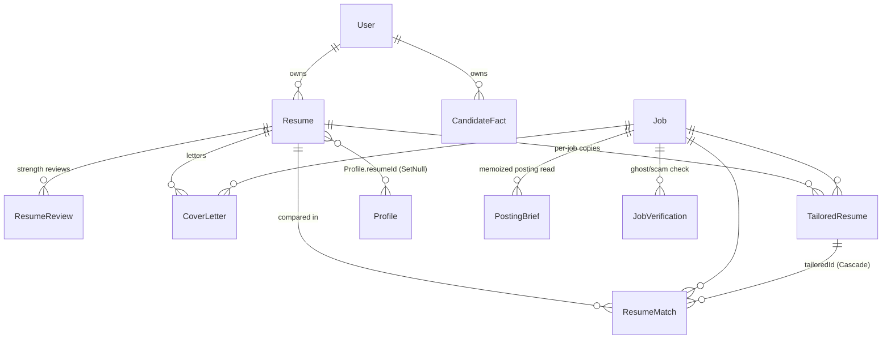
```mermaid
erDiagram
  User ||--o{ Resume : owns
  User ||--o{ CandidateFact : owns
  Resume ||--o{ ResumeMatch : "compared in"
  Resume ||--o{ ResumeReview : "strength reviews"
  Resume ||--o{ CoverLetter : "letters"
  Resume ||--o{ TailoredResume : "per-job copies"
  Resume }o--o{ Profile : "Profile.resumeId (SetNull)"
  Job ||--o{ ResumeMatch : ""
  Job ||--o{ TailoredResume : ""
  Job ||--o{ CoverLetter : ""
  Job ||--o{ PostingBrief : "memoized posting read"
  Job ||--o{ JobVerification : "ghost/scam check"
  TailoredResume ||--o{ ResumeMatch : "tailoredId (Cascade)"
```

### 2.5 ER: application packs and applications

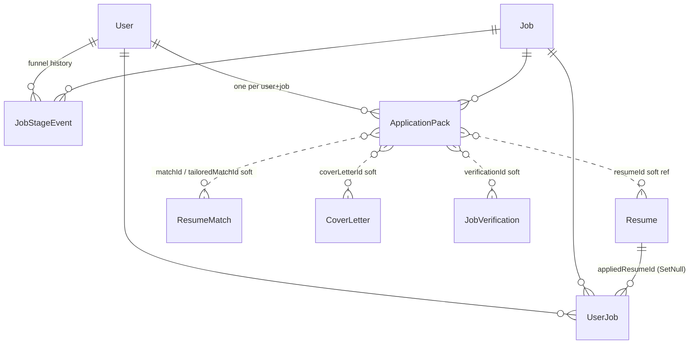
```mermaid
erDiagram
  User ||--o{ UserJob : ""
  Job ||--o{ UserJob : ""
  Resume ||--o{ UserJob : "appliedResumeId (SetNull)"
  User ||--o{ JobStageEvent : "funnel history"
  Job ||--o{ JobStageEvent : ""
  User ||--o{ ApplicationPack : "one per user+job"
  Job ||--o{ ApplicationPack : ""
  ApplicationPack }o..o{ Resume : "resumeId soft ref"
  ApplicationPack }o..o{ ResumeMatch : "matchId / tailoredMatchId soft"
  ApplicationPack }o..o{ CoverLetter : "coverLetterId soft"
  ApplicationPack }o..o{ JobVerification : "verificationId soft"
```

### 2.6 ER: screening / employer mode

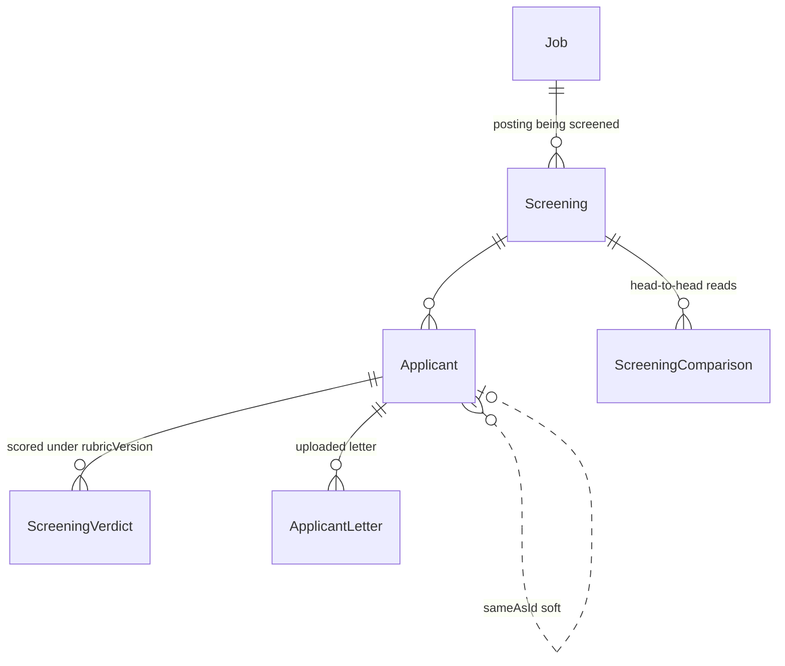
```mermaid
erDiagram
  Job ||--o{ Screening : "posting being screened"
  Screening ||--o{ Applicant : ""
  Screening ||--o{ ScreeningComparison : "head-to-head reads"
  Applicant ||--o{ ScreeningVerdict : "scored under rubricVersion"
  Applicant ||--o{ ApplicantLetter : "uploaded letter"
  Applicant }o..o| Applicant : "sameAsId soft"
```

### 2.7 ER: AI usage and run/ops

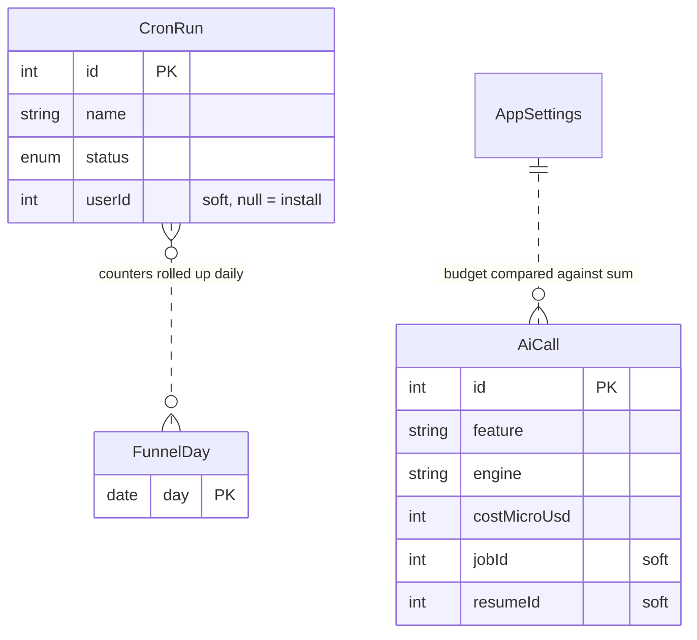
```mermaid
erDiagram
  AiCall {
    int id PK
    string feature
    string engine
    int costMicroUsd
    int jobId "soft"
    int resumeId "soft"
  }
  CronRun {
    int id PK
    string name
    enum status
    int userId "soft, null = install"
  }
  FunnelDay {
    date day PK
  }
  AppSettings ||..o{ AiCall : "budget compared against sum"
  CronRun }o..o{ FunnelDay : "counters rolled up daily"
```

## 3. Key flows

### 3.1 Settings read/write and layering

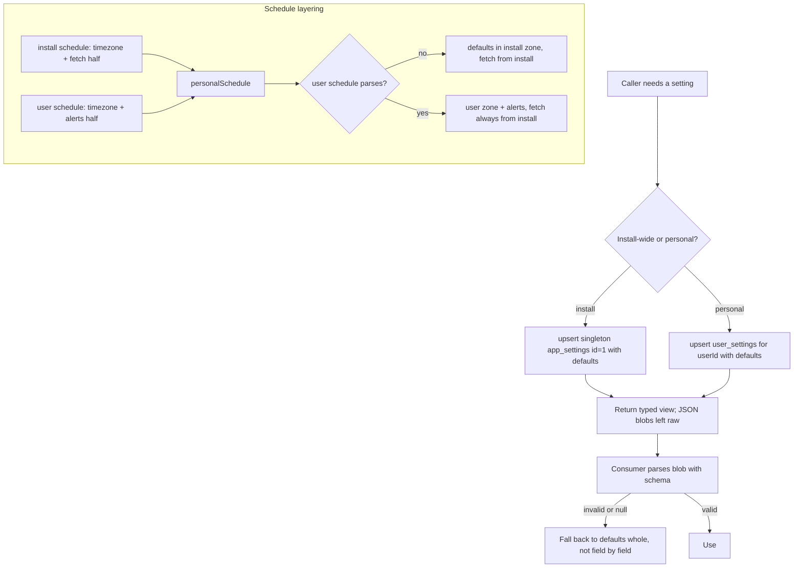
```mermaid
flowchart TD
  A[Caller needs a setting] --> B{Install-wide or personal?}
  B -- install --> C[upsert singleton app_settings id=1 with defaults]
  B -- personal --> D[upsert user_settings for userId with defaults]
  C --> E[Return typed view; JSON blobs left raw]
  D --> E
  E --> F[Consumer parses blob with schema]
  F -- invalid or null --> G[Fall back to defaults whole, not field by field]
  F -- valid --> H[Use]
  subgraph Schedule layering
    S1[install schedule: timezone + fetch half] --> S3[personalSchedule]
    S2[user schedule: timezone + alerts half] --> S3
    S3 --> S4{user schedule parses?}
    S4 -- no --> S5[defaults in install zone, fetch from install]
    S4 -- yes --> S6[user zone + alerts, fetch always from install]
  end
```

### 3.2 Secret merges and the global write lock

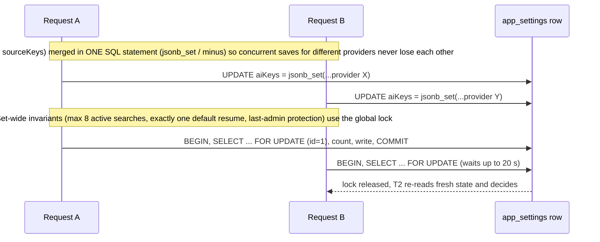
```mermaid
sequenceDiagram
  participant T1 as Request A
  participant T2 as Request B
  participant DB as app_settings row
  Note over T1,T2: Key maps (aiKeys, sourceKeys) merged in ONE SQL statement (jsonb_set / minus) so concurrent saves for different providers never lose each other
  T1->>DB: UPDATE aiKeys = jsonb_set(...provider X)
  T2->>DB: UPDATE aiKeys = jsonb_set(...provider Y)
  Note over T1,T2: Set-wide invariants (max 8 active searches, exactly one default resume, last-admin protection) use the global lock
  T1->>DB: BEGIN, SELECT ... FOR UPDATE (id=1), count, write, COMMIT
  T2->>DB: BEGIN, SELECT ... FOR UPDATE (waits up to 20 s)
  DB-->>T2: lock released, T2 re-reads fresh state and decides
```

### 3.3 First sign-in / user provisioning

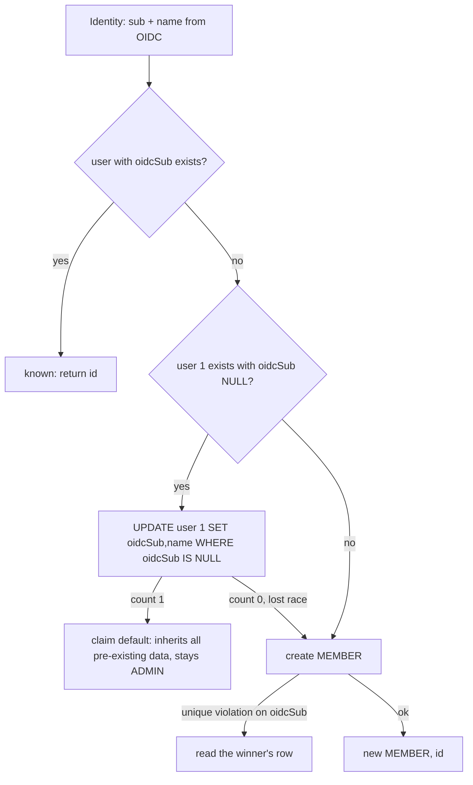
```mermaid
flowchart TD
  A[Identity: sub + name from OIDC] --> B{user with oidcSub exists?}
  B -- yes --> K[known: return id]
  B -- no --> C{user 1 exists with oidcSub NULL?}
  C -- yes --> D[UPDATE user 1 SET oidcSub,name WHERE oidcSub IS NULL]
  D -- count 1 --> E[claim default: inherits all pre-existing data, stays ADMIN]
  D -- count 0, lost race --> F[create MEMBER]
  C -- no --> F
  F -- unique violation on oidcSub --> G[read the winner's row]
  F -- ok --> H[new MEMBER, id]
```

### 3.4 Role change / removal

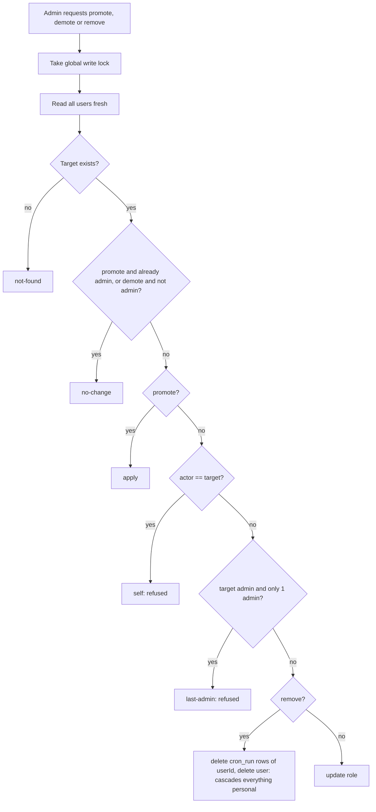
```mermaid
flowchart TD
  A[Admin requests promote, demote or remove] --> B[Take global write lock]
  B --> C[Read all users fresh]
  C --> D{Target exists?}
  D -- no --> X1[not-found]
  D -- yes --> E{promote and already admin, or demote and not admin?}
  E -- yes --> X2[no-change]
  E -- no --> F{promote?}
  F -- yes --> OK[apply]
  F -- no --> G{actor == target?}
  G -- yes --> X3[self: refused]
  G -- no --> H{target admin and only 1 admin?}
  H -- yes --> X4[last-admin: refused]
  H -- no --> I{remove?}
  I -- yes --> J[delete cron_run rows of userId, delete user: cascades everything personal]
  I -- no --> K[update role]
```

### 3.5 Retention cleanup (daily cron touching the data model)

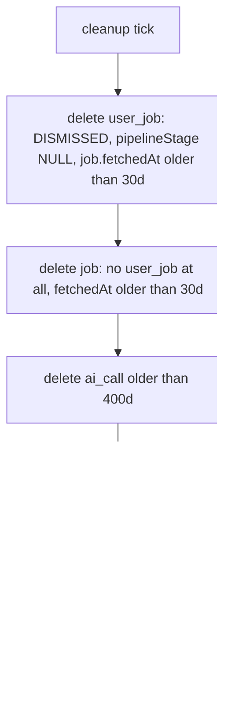
```mermaid
flowchart TD
  A[cleanup tick] --> B[delete user_job: DISMISSED, pipelineStage NULL, job.fetchedAt older than 30d]
  B --> C[delete job: no user_job at all, fetchedAt older than 30d]
  C --> D[delete ai_call older than 400d]
  D --> E[delete screening where retainUntil passed: cascades applicants, files, verdicts]
  E --> F[delete cron_run older than 90d and not RUNNING]
```

### 3.6 Data-only import (restore from a Docker install)

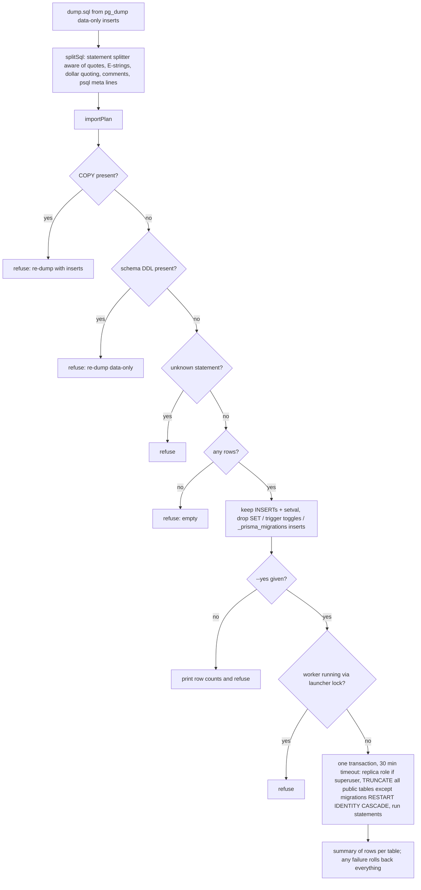
```mermaid
flowchart TD
  A[dump.sql from pg_dump data-only inserts] --> B[splitSql: statement splitter aware of quotes, E-strings, dollar quoting, comments, psql meta lines]
  B --> C[importPlan]
  C --> D{COPY present?}
  D -- yes --> R1[refuse: re-dump with inserts]
  D -- no --> E{schema DDL present?}
  E -- yes --> R2[refuse: re-dump data-only]
  E -- no --> F{unknown statement?}
  F -- yes --> R3[refuse]
  F -- no --> G{any rows?}
  G -- no --> R4[refuse: empty]
  G -- yes --> H[keep INSERTs + setval, drop SET / trigger toggles / _prisma_migrations inserts]
  H --> I{--yes given?}
  I -- no --> R5[print row counts and refuse]
  I -- yes --> J{worker running via launcher lock?}
  J -- yes --> R6[refuse]
  J -- no --> K[one transaction, 30 min timeout: replica role if superuser, TRUNCATE all public tables except migrations RESTART IDENTITY CASCADE, run statements]
  K --> L[summary of rows per table; any failure rolls back everything]
```

## 4. State machines

### 4.1 Job inbox status (UserJob.status)

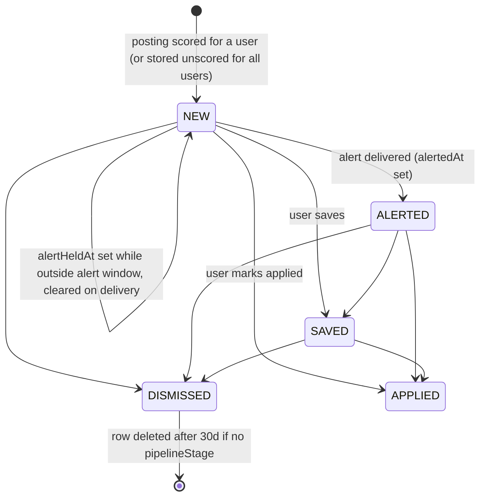
```mermaid
stateDiagram-v2
  [*] --> NEW : posting scored for a user (or stored unscored for all users)
  NEW --> ALERTED : alert delivered (alertedAt set)
  NEW --> NEW : alertHeldAt set while outside alert window, cleared on delivery
  NEW --> SAVED : user saves
  ALERTED --> SAVED
  NEW --> DISMISSED
  ALERTED --> DISMISSED
  SAVED --> DISMISSED
  NEW --> APPLIED : user marks applied
  ALERTED --> APPLIED
  SAVED --> APPLIED
  DISMISSED --> [*] : row deleted after 30d if no pipelineStage
```

Status is orthogonal to `pipelineStage` (free string, funnel once applied).

### 4.2 Pipeline stage (UserJob.pipelineStage)

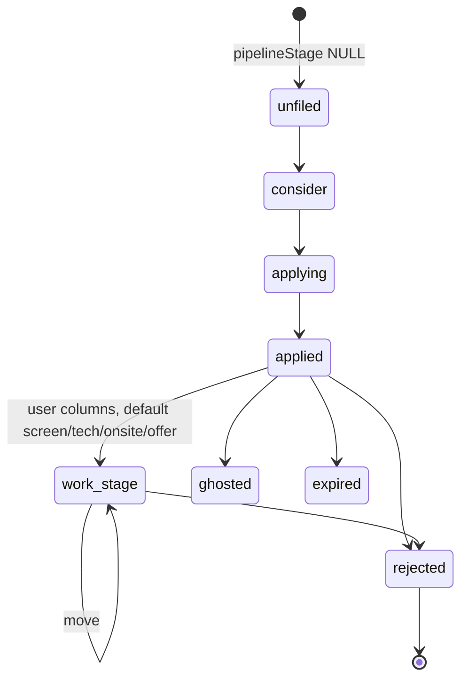
```mermaid
stateDiagram-v2
  [*] --> unfiled : pipelineStage NULL
  unfiled --> consider
  consider --> applying
  applying --> applied
  applied --> work_stage : user columns, default screen/tech/onsite/offer
  work_stage --> work_stage : move
  applied --> rejected
  work_stage --> rejected
  applied --> ghosted
  applied --> expired
  rejected --> [*]
```

Fixed keys: `consider`, `applying`, `applied` (entry) and `rejected`, `ghosted`, `expired` (terminal; the board groups them under a display-only `no-offer` column). Reserved key names also include `unfiled`. Each transition appends a `JobStageEvent` (from, to or NULL=cleared, real-world day, write time, source ui|backfill|correction).

### 4.3 Company source health

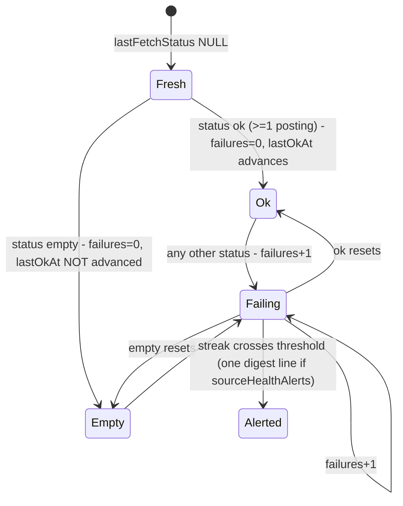
```mermaid
stateDiagram-v2
  [*] --> Fresh : lastFetchStatus NULL
  Fresh --> Ok : status ok (>=1 posting) - failures=0, lastOkAt advances
  Fresh --> Empty : status empty - failures=0, lastOkAt NOT advanced
  Ok --> Failing : any other status - failures+1
  Empty --> Failing
  Failing --> Failing : failures+1
  Failing --> Ok : ok resets
  Failing --> Empty : empty resets
  Failing --> Alerted : streak crosses threshold (one digest line if sourceHealthAlerts)
```

Status vocabulary: ok, empty, slug_gone, auth, rate_limit, server, network, bad_payload, unknown. Any status not ok/empty increments (so new error kinds cannot be silently missed).

### 4.4 Application pack

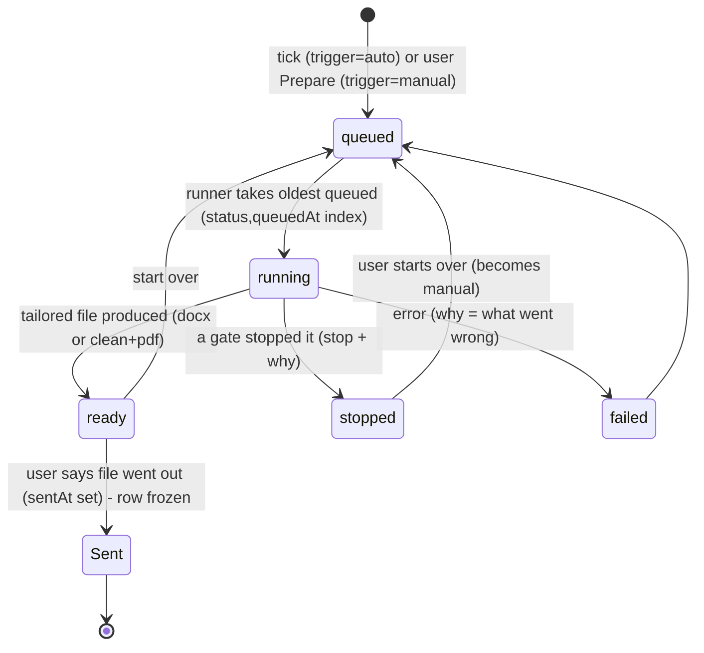
```mermaid
stateDiagram-v2
  [*] --> queued : tick (trigger=auto) or user Prepare (trigger=manual)
  queued --> running : runner takes oldest queued (status,queuedAt index)
  running --> ready : tailored file produced (docx or clean+pdf)
  running --> stopped : a gate stopped it (stop + why)
  running --> failed : error (why = what went wrong)
  stopped --> queued : user starts over (becomes manual)
  failed --> queued
  ready --> queued : start over
  ready --> Sent : user says file went out (sentAt set) - row frozen
  Sent --> [*]
```

`notifiedAt` is set when the grouped "packs ready" message carried it. Unique `(userId, jobId)`: one row per person+posting; it is also the work queue.

### 4.5 Gmail connection

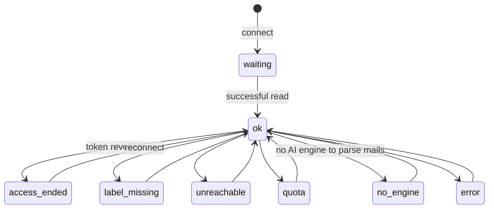
```mermaid
stateDiagram-v2
  [*] --> waiting : connect
  waiting --> ok : successful read
  ok --> access_ended : token revoked
  ok --> label_missing
  ok --> unreachable
  ok --> quota
  ok --> no_engine : no AI engine to parse mails
  ok --> error
  access_ended --> ok : reconnect
  label_missing --> ok
  unreachable --> ok
  quota --> ok
  no_engine --> ok
  error --> ok
```

`checkRequestedAt` is set by "Check now"/fresh connection and cleared when the worker takes it.

### 4.6 Cron run

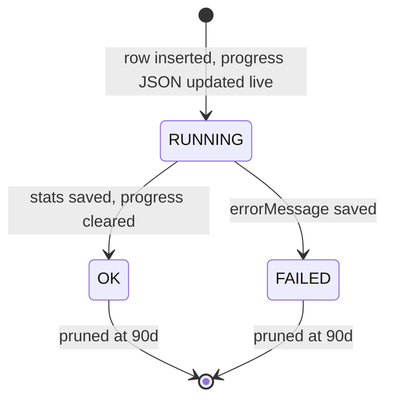
```mermaid
stateDiagram-v2
  [*] --> RUNNING : row inserted, progress JSON updated live
  RUNNING --> OK : stats saved, progress cleared
  RUNNING --> FAILED : errorMessage saved
  OK --> [*] : pruned at 90d
  FAILED --> [*] : pruned at 90d
```

RUNNING rows are never pruned.

### 4.7 Screening applicant

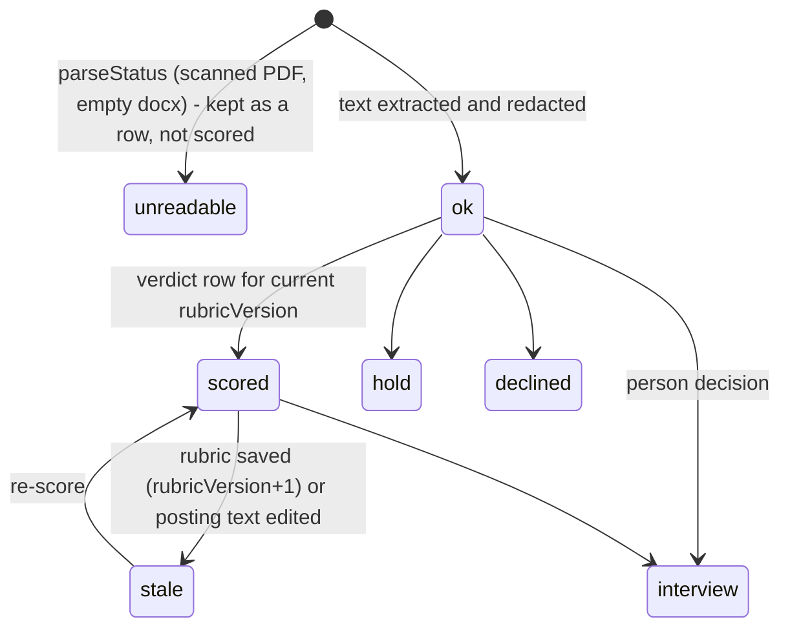
```mermaid
stateDiagram-v2
  [*] --> unreadable : parseStatus (scanned PDF, empty docx) - kept as a row, not scored
  [*] --> ok : text extracted and redacted
  ok --> scored : verdict row for current rubricVersion
  scored --> stale : rubric saved (rubricVersion+1) or posting text edited
  stale --> scored : re-score
  ok --> interview : person decision
  ok --> hold
  ok --> declined
  scored --> interview
```

Decisions are only ever set by the person (never by the tool). All of it is deleted when `retainUntil` passes.

### 4.8 Company candidate (discovery)

```mermaid
stateDiagram-v2
  [*] --> PENDING
  PENDING --> PROMOTED : becomes a Company row (promotedAt)
  PENDING --> IGNORED
  PENDING --> DEAD : probe finds nothing
```

## 5. Feature list

| ID | Feature | What it does | Trigger | Key config/settings |
|---|---|---|---|---|
| DAT-01 | Single database client | One ORM client; connection URL comes from env, or (if unset) from the built-in local database's saved state; logs warn+error only | process start | `DATABASE_URL` |
| DAT-02 | Unique-violation detection | One predicate keyed on error code (not message) for a unique-constraint failure so duplicates can be reported instead of 500 | any racy write | - |
| DAT-03 | Retry-once on unique race | Re-runs a whole write (fresh transaction) exactly once after a unique violation so the second attempt sees the winner's row | racy writes (job insert, targets, etc.) | - |
| DAT-04 | Single-connection URL | Derives a URL with `connection_limit=1` for the session-level fetch lock client | worker start | - |
| DAT-05 | Global write lock | Ensures settings row exists, then `SELECT ... FOR UPDATE` on it inside a transaction (20 s budget) so set-wide invariants (<=8 active searches, one default resume, primary-search switch/delete, last-admin) serialize | settings/resume/profile/user writes | lock timeout 20 000 ms |
| DAT-06 | Install settings singleton | `app_settings` row id=1 auto-created with defaults on first read/write | any settings access | see 6.3 |
| DAT-07 | Per-user settings row | `user_settings` row per user, created lazily with defaults on first read or write | any personal setting access | see 6.3 |
| DAT-08 | Column classification (global vs personal) | Explicit lists of which settings columns belong to install vs person; tests fail if a column is in neither | build/test | `GLOBAL_COLUMNS`, `PERSONAL_COLUMNS` |
| DAT-09 | Layered schedule | Install stores timezone+fetch cadence; person stores timezone+alert timing; effective schedule = person's zone+alerts with install's fetch half; invalid -> defaults whole | every heartbeat / alert decision | `schedule` JSON on both rows |
| DAT-10 | Schedule save planning | A save writes the person's half always and the install's half only for admins; members' fetch fields are displayed but not saved | settings form submit | role |
| DAT-11 | Display settings read | One read per request returning effective timezone, stored locale and whether setup is complete | each page request | locale, setupCompletedAt |
| DAT-12 | Setup completion + language keep | Marks first-run wizard done; if the user has no locale and the wizard was read in a non-English language, that language becomes their choice (English chooses nothing) | wizard finish/skip | `setupCompletedAt`, `locale` |
| DAT-13 | Instance identity | Random UUID created once; seeds the cron minute so installs do not hit boards simultaneously; never rendered | worker boot | `instanceId` |
| DAT-14 | AI engine config storage | JSON `{order:[provider ids], models:{id:{classifier,resume}}}`; NULL = follow environment | AI settings tab | `aiEngine` |
| DAT-15 | AI key storage (atomic merge) | Per-provider pasted keys in a JSON map merged/removed with a single SQL statement; never part of the ordinary settings view or logs | AI settings tab | `aiKeys` |
| DAT-16 | Source key storage (atomic merge) | Per keyed source `{SOURCE:{field:secret}}`; sets create the parent object first, blank removes the field | Sources settings | `sourceKeys` |
| DAT-17 | Classifier mode | `single` or `two_stage`; unknown stored value reads as `single` | settings | `classifierMode` |
| DAT-18 | Fetch pause / source toggles | `fetchingEnabled` (default false: fresh install paused), `disabledSources` (AtsType strings), `hnParserEnabled`; `pausedFamilies` merges disabled list with HN_HIRING when HN parser off; unknown names filtered before enum queries | settings, discovery page | defaults false/[]/false |
| DAT-19 | Discovery toggle | Gates auto-creation of candidates and the weekly probe | settings | `discoveryEnabled` |
| DAT-20 | Source-health alert switch | Digest line when a source crosses failure streak | settings | `sourceHealthAlerts` default true |
| DAT-21 | AI budget | Monthly ceiling in cents (NULL = none); warnings at 80% and 100% marker `YYYY-MM:80/100`; changing the ceiling resets the marker; never blocks calls | settings, per AI call | `aiBudgetCents`, `aiBudgetAlerted` |
| DAT-22 | Engine endpoints | OpenAI-compatible base URL, local engine URL, local context-window tokens (NULL = defaults, default window 16 384) | AI tab | `openAiBaseUrl`, `localAiUrl`, `localContextTokens` |
| DAT-23 | Update check state | Opt-in weekly release check; stores latest version + checked time | weekly cleanup | `updateCheck` default false |
| DAT-24 | Employer mode switch + retention | Global flag enabling screening section; `screeningRetentionDays` clamped 7..365 (default 90) | settings | `employerMode`, `screeningRetentionDays` |
| DAT-25 | Employers-filled marker | Stamp that startup back-filled `employerKey` on pre-existing jobs | boot | `employersFilledAt` |
| DAT-26 | Personal switches | Alerts on/off, application tracking, stale-applications digest (all default true) | settings | `telegramEnabled`, `applicationTrackingEnabled`, `staleApplicationsDigestEnabled` |
| DAT-27 | Re-apply window | Days (30/60/90/180) in which postings at a company applied to are turned away; NULL off | settings | `reapplyDays` |
| DAT-28 | Cover-letter standing angles | `{whyCompany, problem, approach, notes}` persisted per person, prefilled on job pages | letter generation | `coverAngles` |
| DAT-29 | Pipeline stage config | Ordered custom work columns `{key,label}`; key `[a-z0-9-]{1,40}`, label 1..40, max 10; reserved keys excluded; default screen/tech/onsite/offer | settings | `pipelineStages` |
| DAT-30 | Pack settings | JSON: enabled, enabledAt, minFit (50-100, 90), dailyLimit (0-50, 5; 0 = unlimited), maxAgeDays (1-60, 7), coverLetter never/asked/always (never), edit policy (sections title/summary/skills/experience, maxBullets 0-6, removals, keywords); bad values replaced individually; NULL = off | settings | `pack` |
| DAT-31 | Locale | Interface language code; unknown code (after rollback) reads as null | menu, settings, wizard | `locale` |
| DAT-32 | Notification targets | Per-user Telegram (bot token + chat) or Discord (webhook) destinations; add returns null on duplicate; toggle/delete scoped to owner; `lastUsed` stamped best-effort | settings | kind, active |
| DAT-33 | Telegram target test | Calls getMe then sendMessage with a 10 s abort timeout and reports bot username or the error | user clicks Test | 10 000 ms |
| DAT-34 | Company mutes | Per-user blocked employers keyed by normalized employer key; stops new postings pre-AI and hides stored ones; deleting undoes | user | PK `(userId,key)` |
| DAT-35 | Source catalog | `Company` rows unique by `(atsType, atsToken)` with activity, watchlist (checkEvery hour/day/week, alertPolicy matches/all, nextCheckAt), change-watch hashes, HTTP validators, crawl delay, pasted lines, user-supplied mapping config | seed, UI, import | see model table |
| DAT-36 | Folder-source ledger | `SourceFile` per file seen in a folder source: size, mtime, sha256, kind, status done/waiting/skipped/failed, rowsRead, timestamps | worker tick | unique `(companyId, relPath)` |
| DAT-37 | Job storage | Shared posting with structured location (workplace, countries, regions, locationSource), salary with currency/period, liveness verdict, SimHash, cross-listing link, optional original description, licence payload | fetch / paste / import | unique `(companyId, externalId)` |
| DAT-38 | Per-profile scores | `JobScore` one verdict per (job, search profile) | classifier | unique `(jobId, profileId)` |
| DAT-39 | Per-user job state | `UserJob` best-of verdict, status, alert stamps, application tracking, applied-resume snapshot | classifier, UI | unique `(userId, jobId)` |
| DAT-40 | Stage history | Append-only `JobStageEvent` for each pipeline transition | UI | indexes jobId+recordedAt |
| DAT-41 | Searches (profiles) | Per-user searches with stack/role/seniority/location/salary/threshold/priority rules, active flag, alert routing, linked resume; primary search on `User` | settings | max 8 active; minFitScore default 70 |
| DAT-42 | Resume storage | Uploaded bytes + extracted text + scan results + structure JSON + answers + optional remote-origin triple | upload | `version`, `isDefault` |
| DAT-43 | Resume review history | One row per on-demand strength review, with computed score | user | - |
| DAT-44 | Resume match storage | Comparison of a resume (or tailored copy) with a job, with text snapshot, version, keywords/actions/removals/condense/breakdown/hard requirements | user, pack | - |
| DAT-45 | Tailored resume | One per (resume, job) edited copy with its own bytes; never alters the master | user, pack | unique `(resumeId, jobId)` |
| DAT-46 | Candidate facts | Per-user confirmed/denied terms (lowercase) with note | user | unique `(userId, term)` |
| DAT-47 | Cover letters | Generated letters with edit text, gate verdict/notes, prompt version | user, pack | - |
| DAT-48 | Posting briefs | Memoized AI read of a posting keyed by hash of title+description and prompt version | match flow | unique `(jobId, postingHash, promptVersion)` |
| DAT-49 | Job verification | Ghost/scam web-search verdict with evidence | user | - |
| DAT-50 | Application packs | Unattended-prep result and queue in one row per (user, job) with files stored as bytes | tick / user | unique `(userId, jobId)` |
| DAT-51 | Screening (employer mode) | Screening, applicants (original bytes + text + redacted text), letters, verdicts, comparisons; deduped by `(screeningId,textHash)` | admin | `retainUntil` |
| DAT-52 | AI call ledger | Metadata-only record per AI attempt with tokens, micro-dollar cost, vendor-reported cost, fallback flag; soft refs to job/resume | every AI call | 400-day retention |
| DAT-53 | Run history | `CronRun` rows with stats, live progress JSON, error; optionally per user | every scheduled job | 90-day retention |
| DAT-54 | Funnel rollup | `FunnelDay` per UTC day with counters JSON, outlives run pruning | each fetch tick | never pruned |
| DAT-55 | Discovery candidates | `CompanyCandidate` queue of possible sources | HN parse, probes | unique `(atsType, atsToken)` |
| DAT-56 | Gmail connection + ledger | One per user (refresh token secret, label, status, window), ledger of read mail ids | worker hourly / Check now | unique `(connectionId, messageId)` |
| DAT-57 | Reactive Resume connection | One per user: instance URL + API key | settings | PK `userId` |
| DAT-58 | Users and roles | `User` ADMIN/MEMBER, `oidcSub` unique; row 1 "Default user" ADMIN created by migration | sign-in | `DEFAULT_USER_ID=1` |
| DAT-59 | OIDC provisioning | known -> existing; else claim unclaimed user 1 (first sign-in becomes admin owning prior data); else create MEMBER; race-safe | sign-in | - |
| DAT-60 | Role/removal rules | No self demote/remove, never remove/demote last admin, no-op on same role; judged under global lock; removal deletes user's cron_runs then user (cascade) | admin UI | - |
| DAT-61 | User summaries | Counts of searches, postings, resumes, comparisons, letters, destinations and last-active (newest of resume update, settings update, stage event, applied date) | users page | - |
| DAT-62 | Route access classes | Lists of open, personal, admin routes; most-specific match; unlisted = admin; build fails for unclassified route | every request | - |
| DAT-63 | Fallback user | If the users table cannot be read, run as id 1 "Default user" ADMIN | no-sign-in installs | - |
| DAT-64 | Seed sources | Idempotent upsert of ~30 starter source rows; deletes obsolete tokens; never touches `active` of existing rows | boot (init) | see 6.9 |
| DAT-65 | Retention cleanup | Prunes dismissed rows, orphan jobs, AI calls, expired screenings, old runs | daily cron | 30 / 400 / 90 days |
| DAT-66 | SQL dump splitter | Quote/comment/dollar-quote-aware statement splitter dropping psql meta-commands | db-import | - |
| DAT-67 | Import planning | Accepts only INSERT and setval; refuses COPY, DDL, unknown statements, empty dumps; ignores migrations table and SET/trigger statements; counts rows per table | db-import | - |
| DAT-68 | Destructive import | Single transaction truncating all public tables (except migrations) with identity restart, replaying inserts, requires `--yes`, refuses while worker runs | CLI `db:import` | timeout 30 min, progress every 2 000 |
| DAT-69 | Normalized job contract | Shared in-memory shape for a fetched posting (hints, payload, employer, sourceFile, handPicked, undated) before persistence | all fetchers | `NormalizedJob` |

## 6. Business rules & invariants

### 6.1 Identity / uniqueness keys (dedupe)

| Entity | Key |
|---|---|
| Company | `(atsType, atsToken)` |
| Job | `(companyId, externalId)`; cross-company near-duplicate via SimHash of description (last 90 days scanned) stored as `crossListedOfJobId` annotation only; nothing merged/hidden |
| JobScore | `(jobId, profileId)` - re-classify updates in place |
| UserJob | `(userId, jobId)` |
| TailoredResume | `(resumeId, jobId)` |
| ApplicationPack | `(userId, jobId)` |
| PostingBrief | `(jobId, postingHash, promptVersion)` - the memo key; prevents double paying when two comparisons start together |
| CandidateFact | `(userId, term)` lowercase |
| CompanyMute | PK `(userId, key)` where key = normalized employer name |
| NotificationTarget | `(userId, botToken, chatId)` and `(userId, webhookUrl)`; NULLs distinct so Telegram and Discord never collide |
| Applicant | `(screeningId, number)` and `(screeningId, textHash)` (identical document twice = one row) |
| GmailMessage | `(connectionId, messageId)` - a mail is never paid for twice |
| SourceFile | `(companyId, relPath)` (forward slashes) |
| CompanyCandidate | `(atsType, atsToken)` |
| User | `oidcSub` unique, `primaryProfileId` unique |

### 6.2 Cascade / deletion rules

- Cascade from `Company` -> `Job`, `SourceFile`; `Job` -> scores, user jobs, matches, tailored copies, briefs, verifications, letters, stage events, screenings, packs.
- `User` cascades to its profiles, user jobs, resumes, facts, packs, settings, targets, mutes, Gmail and Reactive Resume connections, stage events. Cron runs of that user are deleted manually (no FK).
- `Resume` cascades to matches, reviews, letters, tailored copies. Deleting a resume only nulls `Profile.resumeId` and `UserJob.appliedResumeId` (SetNull); a profile must survive its file.
- `Job.crossListedOfJobId` and `Profile.notificationTargetId` and `User.primaryProfileId`: SetNull.
- `Screening` cascades to applicants, letters, verdicts, comparisons (the cascade is the retention policy).
- Intentionally no FKs: `AiCall.jobId/resumeId`, `ApplicationPack.resumeId/matchId/tailoredMatchId/verificationId/coverLetterId`, `CronRun.userId`, `Applicant.sameAsId` - history outlives targets.

### 6.3 Defaults and ranges

Install settings defaults: classifierMode `single`; hnParserEnabled false; disabledSources []; discoveryEnabled false; **fetchingEnabled false** (fresh installs start paused); sourceHealthAlerts true; updateCheck false; aiBudgetCents null; employerMode false; screeningRetentionDays 90 (clamp 7..365); setupCompletedAt null (redirects `/` to the wizard); schedule null.

User settings defaults: telegramEnabled true; applicationTrackingEnabled true; staleApplicationsDigestEnabled true; reapplyDays null; coverAngles/pipelineStages/schedule/pack/locale null.

Schedule defaults: timezone = configured TZ (invalid -> UTC); fetch every `hour`, 00-23, all 7 days; alerts mode `instant`, window 08-22, all days, digest at 09. `FETCH_EVERY` = hour|2h|4h|day (2h/4h/day gap with 5 min tolerance); alert modes instant|window|digest; at most 4 digest hours; days ISO 1-7.

Profile defaults: `minFitScore` 70, `minSalaryUsd` 0 (no filter), `workplace` [REMOTE], `relocation` "no" (no|yes|sponsorship), `active` false, countries/regions empty = anywhere, `priorityRules` []. Max 8 active profiles; profile with no stackRequired and no roleTypes is "blank": never auto-activated, refuses activation, classifier scores capped at 50 with a `no-profile-stack` flag.

Company defaults: `active` true, `checkEvery` hour, `alertPolicy` matches, `watched` false, `nextCheckAt` NULL = due now.

Resume: `version` starts 1 and bumps per upload-new-version; exactly one `isDefault` per user (enforced under the global lock). Matches record the version they scored and snapshot the text so highlights stay valid.

ApplicationPack: only `trigger=auto` rows count toward the daily limit (counted per UTC day); the runner takes the oldest `queued` row.

Retention: stale dismissed rows and orphan jobs 30 days since `fetchedAt` (never for rows with a pipelineStage); AI ledger 400 days; run history 90 days (RUNNING exempt); funnel day rows kept forever; screenings by `retainUntil`.

### 6.4 Money and units

AI cost stored as integer micro-dollars (ours from a price table plus vendor-reported figure beside it); `billing` decides which total a row joins and the three are never added. Unreported token counts are NULL, never 0. Budget in cents. Salary columns are the posting's own numbers with ISO-4217 `salaryCurrency` and `salaryPeriod` (year|month|week|day|hour); NULL currency/period on old rows means USD per year.

### 6.5 Employer identity

`Job.employer` is set only for aggregator sources (their own company field); vendor boards/feeds/pastes leave it NULL. `Job.employerKey` is the normalized key of whoever hires (employer, else the company row's name), written on every insert, and is what mutes and re-apply windows match on. "Acme, Inc." and "ACME" share one key.

### 6.6 Location columns

`workplace` REMOTE|HYBRID|ONSITE|UNKNOWN (UNKNOWN = nothing said, not on-site). For REMOTE, `countries` are where the candidate may live; for HYBRID/ONSITE where the office is. `regions` contains only markers the source named (EU, EUROPE, WORLDWIDE...). `locationSource`: structured | parsed | NULL. Location string itself is never rewritten. GIN indexes on countries/regions.

### 6.7 Alerting columns

`alertedAt` set once delivered; `alertHeldAt` set when a match was scored outside the alert window so a later heartbeat sends a grouped message; the row stays NEW until sent. Watchlist `alertPolicy=all` keeps and alerts every posting regardless of filter and threshold. Change-watch hash (`lastContentHash`) only advances when an alert is actually sent; unsent change waits in `pendingContentHash`.

### 6.8 Concurrency

- Check-then-act on set-wide invariants is serialized with a row lock on `app_settings` id 1 (20 s transaction timeout).
- JSON key maps are merged in one SQL statement, never read-modify-write.
- Unique violations are retried once from scratch.
- Job insert by two sources racing relies on `(companyId, externalId)`.
- Sign-in claim of the default user is guarded by `WHERE oidcSub IS NULL`.

### 6.9 Seed data behaviour

- Runs at boot (idempotent). First deletes `Company` rows matching a hard-coded obsolete `(atsType, atsToken)` list (14 pairs of boards that moved or were wrong guesses), then upserts each seed row by `(atsType, atsToken)`.
- Upsert **updates only `name` and `careerUrl`**; `active` is set only on create, so a user's toggles survive re-seeding.
- Active by default (aggregators, 9 rows): RemoteOK, Remotive, HN /jobs, Jobicy, Working Nomads, 4 Day Week, Himalayas, WeWorkRemotely Back-End and Full-Stack.
- Inactive reference/regional rows: one example board per vendor (Recruitee, Breezy, BambooHR, Pinpoint, Personio, Teamtailor), LaraJobs, two Arbeitnow rows, DOU, Djinni, solid.jobs, three DevITjobs/GermanTechJobs, Landing.jobs, JobTech Sweden, Golangprojects.
- No employer board is on by default; curated boards come as a starter pack the user previews and confirms.
- Migration (not seed) creates user 1 ("Default user", ADMIN) and sets the sequence to 1. Settings rows are created lazily on first read.

### 6.10 Stage config rules

Fixed entry stages `consider`, `applying`, `applied`; fixed end states `rejected`, `ghosted`, `expired`; display column `no-offer` (a card dropped there takes `rejected`). User work columns max 10, default four; list must pass validation or default is used; empty list -> default.

## 7. External dependencies & integration contracts

| Dependency | Contract |
|---|---|
| PostgreSQL 16 | Required. Features used: JSON/JSONB, `text[]` and enum arrays, GIN indexes on arrays, `BigInt` (SimHash), `bytea` (resumes, packs), `FOR UPDATE` row lock, `jsonb_set` and `-` operators, advisory/session lock via a single-connection client, `TRUNCATE ... RESTART IDENTITY CASCADE`, `session_replication_role = replica` for superusers. |
| Connection URL | `DATABASE_URL` env; if absent, the built-in local database's URL from the data folder's state file is injected into the environment (also needed by the migration CLI). |
| Migrations | Directory of ordered SQL migrations (113 present); startup applies them (or schema push if none). A drift check in CI compares schema and migrations. |
| pg_dump format for import | `--data-only --inserts --column-inserts`; no COPY, no DDL; `_prisma_migrations` rows ignored. Dump from a newer version with unknown columns fails and rolls back. |
| OIDC identity provider | Supplies stable `sub` and display name; mapped to `User.oidcSub`. |
| Telegram Bot API | `getMe`, `sendMessage` (plain text, previews off) for target tests; 10 s timeout. |
| Secrets at rest | AI keys, source keys, Telegram bot tokens, Discord webhooks, Gmail refresh token, Reactive Resume API key are stored in plaintext columns; code reads them only through dedicated accessors (never in the general settings view, never logged). |

JSON column shapes (validated on read with a schema; invalid -> defaults): `schedule`, `pack`, `pipelineStages`, `coverAngles`, `aiEngine`, `aiKeys`, `sourceKeys`, `Company.sourceConfig` (`{mapping, include}`), `Company.validator` (`{url, etag, lastModified, count}`), `Profile.priorityRules` (`[{label, techsAny[], regionsAny[], minFitFloor}]`), `Resume.issues` (`[{section, issue, fix}]`), `Resume.answers` (`[{question, answer, answeredAt}]`), `Resume.structure` (JSON Resume subset), match `keywords/actions/removals/condense/breakdown/hardRequirements`, review `grades/advice/breakdown`, `Screening.rubric` (versioned criteria with kind, mode gate|scored|note, stars), `ScreeningVerdict.facts/breakdown`, `ScreeningComparison.readings`, `ApplicationPack.edits`, `CronRun.stats/progress`, `FunnelDay.counts`.

## 8. Model reference

Legend: UK = unique key, FK = foreign key.

### 8.1 Enums

| Enum | Values | Meaning |
|---|---|---|
| AtsType | GREENHOUSE, LEVER, ASHBY, WORKABLE, SMARTRECRUITERS, RECRUITEE, BREEZY, BAMBOOHR, PINPOINT, RIPPLING, PERSONIO, TEAMTAILOR (per-company vendor boards); LARAJOBS_RSS, REMOTEOK, REMOTIVE, ARBEITNOW, WEWORKREMOTELY, GOLANGPROJECTS, JOBICY, HN_JOBS, WORKINGNOMADS, HIMALAYAS, FOURDAYWEEK, DOU, DJINNI, SOLIDJOBS, DEVITJOBS, LANDINGJOBS, JOBTECH, ADZUNA, FRANCETRAVAIL (aggregators / regional feeds); HN_HIRING (monthly thread parse); FEED (generic RSS/Atom, token = URL); CAREER_PAGE (hash-watch of a page, never yields jobs); BROWSER_PAGE (JS-rendered page, user pastes text, never active); IMPORT (rows from an uploaded file, never active); FOLDER (watched directory); GMAIL (hidden row per person, token `user-<id>`, never active); MANUAL (hand-pasted postings, one inactive row per employer) | Source type; determines fetch strategy. Several are "virtual" (never fetched on the tick): CAREER_PAGE, BROWSER_PAGE, IMPORT, GMAIL, MANUAL |
| JobStatus | NEW, ALERTED, APPLIED, DISMISSED, SAVED | Inbox state per person |
| Workplace | REMOTE, HYBRID, ONSITE, UNKNOWN | Arrangement named by posting; UNKNOWN = unsaid |
| CronRunStatus | RUNNING, OK, FAILED | Run lifecycle |
| CandidateStatus | PENDING, PROMOTED, IGNORED, DEAD | Discovery queue lifecycle |
| NotificationKind | TELEGRAM, DISCORD | Destination channel |
| UserRole | ADMIN, MEMBER | Authorization class |

### 8.2 Models (33)

| # | Model (table) | Purpose | Key fields | Uniqueness / indexes | Relations | Lifecycle |
|---|---|---|---|---|---|---|
| 1 | Company (`company`) | A source row: a company board, aggregator feed, watched page, folder, or virtual source | name, atsType, atsToken, active, careerUrl, health (lastFetchStatus, consecutiveFailures, lastOkAt), watchlist (watched, checkEvery, nextCheckAt, alertPolicy), change-watch (lastContentHash, lastContentAlertAt, pendingContentHash), validator JSON, crawlDelayMs, pastedLines/pastedNew/pastedAt, sourceConfig JSON | UK (atsType, atsToken); idx (active, nextCheckAt) | has Jobs, SourceFiles | Seeded/added in UI/discovery promotion; deleted by admin (cascades jobs) |
| 2 | SourceFile (`source_file`) | Ledger of files seen in a folder source | relPath, size, mtime, sha256, kind (json/jsonl/csv/tsv/html/txt/md/pdf/docx), status (done/waiting/skipped/failed), detail, jobCount, rowsRead, seenAt, readAt | UK (companyId, relPath) | Company (cascade) | Updated each scan; re-read when size/time changes |
| 3 | Job (`job`) | Shared posting | externalId, employer, employerKey, sourceFile, title, url, location, description, descriptionOriginal/RefreshedAt, postedAt, fetchedAt, workplace, countries, regions, locationSource, salaryMin/Max/Currency/Period, sourcePayload, sourceUpdatedAt, sourceCheckedAt, liveness (active/expired/uncertain), livenessCode, livenessCheckedAt, descriptionSimhash, crossListedOfJobId | UK (companyId, externalId); idx crossListedOfJobId, (fetchedAt, simhash), GIN countries, GIN regions, workplace, employerKey | Company, self cross-listing, many children | Inserted by fetch/paste/import; deleted by cleanup when no UserJob and >30d |
| 4 | JobScore (`job_score`) | One search's verdict for one job | fitScore, locationMatch, techMatch[], redFlags[], summary, priorityRulesApplied[], scoredAt | UK (jobId, profileId); idx (profileId, fitScore) | Job, Profile (both cascade) | Created/updated on classify |
| 5 | UserJob (`user_job`) | A person's relationship to a posting | best-of fitScore/techMatch/redFlags/summary/priorityRulesApplied, status, alertedAt, alertHeldAt, appliedAt, recruiterContact, pipelineStage, applicationNotes, appliedResumeId/Version/Text | UK (userId, jobId); idx (userId,status), alertHeldAt, (userId,pipelineStage,appliedAt), jobId, appliedResumeId | User, Job (cascade), Resume (SetNull) | Created when scored/handed to user; dismissed rows pruned at 30d if no stage |
| 6 | CronRun (`cron_run`) | One scheduled/manual job execution | name, startedAt, finishedAt, status, stats, progress, errorMessage, userId | idx (name,userId,startedAt), (name,startedAt), startedAt | none (userId soft) | Created RUNNING, finalized; pruned 90d |
| 7 | FunnelDay (`funnel_day`) | Daily rollup of fetch-tick counters | day (PK, date), counts JSON, updatedAt | PK day | none | Upserted per tick; kept forever |
| 8 | AiCall (`ai_call`) | One AI attempt (metadata only) | at, durationMs, engine, model, resolvedModel, feature, outcome, viaFallback, billing, token counts (input, cacheWrite, cacheWrite1h, cacheRead, output), webSearches, costMicroUsd, reportedMicroUsd, priceAsOf, jobId, resumeId | idx at, jobId, (feature, at) | none | Append-only; pruned 400d |
| 9 | AppSettings (`app_settings`) | Install singleton (id=1) | see 6.3 and DAT-14..25 | PK id default 1 | none | Lazily created |
| 10 | CompanyMute (`company_mute`) | A person's muted employer | key, name, reason, createdAt | PK (userId, key) | User cascade | User-managed |
| 11 | UserSettings (`user_settings`) | A person's settings | see 6.3 | PK userId | User cascade | Lazily created |
| 12 | CompanyCandidate (`company_candidate`) | Possible new source from discovery | name?, atsType, atsToken, source (e.g. `hn-2026-04`), sourceUrl, signal, jobsSeen, status, notes, discoveredAt, promotedAt | UK (atsType, atsToken); idx (status, discoveredAt) | none | PENDING -> PROMOTED/IGNORED/DEAD |
| 13 | NotificationTarget (`notification_target`) | Alert destination | kind, name, botToken, chatId, webhookUrl, active, lastUsed, userId | UK (userId, botToken, chatId), UK (userId, webhookUrl), idx userId | User cascade; Profiles route to it | User-managed |
| 14 | Profile (`profile`) | A saved search | name, stackRequired[], roleTypes[], stackNiceToHave[], stackExclude[], notes, seniority[], countries[], regions[], workplace[], onsiteCities[], residence, relocation, minSalaryUsd, minFitScore, priorityRules JSON, active, notificationTargetId, resumeId, userId | idx active, userId | User (cascade; primaryOf back-ref), NotificationTarget (SetNull), Resume (SetNull), JobScores | User-managed; max 8 active |
| 15 | Resume (`resume`) | Uploaded CV | name, sourceFilename, mimeType, original bytes, text, version, isDefault, scan results (scannedAt, title, seniority, yearsExperience, skills[], primarySkills[], roleTypes[], industries[], summary, issues), structure JSON, answers JSON, remoteId/remoteGeneration/remoteHost (all or none), userId | idx userId | User cascade | Upload, rescan, new version, delete |
| 16 | ResumeReview (`resume_review`) | Job-agnostic strength review | resumeVersion, model, reviewScore (computed), headline, grades, advice, strengths[], breakdown | idx (resumeId, createdAt) | Resume cascade | Append-only history |
| 17 | ResumeMatch (`resume_match`) | Resume-vs-job comparison | tailoredId?, resumeVersion, resumeText snapshot, resumeName, draft, model, matchScore (computed deterministically), summary, strengths[], redFlags[], cautions[], keywords, actions, removals, condense, breakdown, hardRequirements | idx (jobId,createdAt), (resumeId,createdAt), tailoredId | Job, Resume, TailoredResume (cascade) | Created per comparison |
| 18 | TailoredResume (`tailored_resume`) | Edited copy for one job | text, sourceFilename, mimeType, original bytes | UK (resumeId, jobId); idx jobId | Resume, Job cascade | One working copy per job; can be promoted |
| 19 | CandidateFact (`candidate_fact`) | Confirmed/denied skill claim | term, status confirmed/denied, note | UK (userId, term) | User cascade | User-managed |
| 20 | CoverLetter (`cover_letter`) | Generated letter | resumeVersion, kind (default letter), tone (warm), text, editedText, model, promptVersion, keywordsUsed[], gapsAcknowledged[], usedVerification, gateVerdict pass/warn (block only via manual edit), gateNotes[] | idx (jobId, createdAt), resumeId | Job, Resume cascade | Blocked letters never stored |
| 21 | ApplicationPack (`application_pack`) | Unattended preparation + queue | see 4.4; status, trigger, step, stop, why, soft refs, baseText, text, edits, scoreBefore/After, docx/pdf bytes, document own/clean, fileName, sentAt, notifiedAt, queuedAt/startedAt/finishedAt | UK (userId, jobId); idx (status, queuedAt), (userId, status) | User, Job cascade | State machine 4.4 |
| 22 | JobStageEvent (`job_stage_event`) | Funnel history | fromStage?, toStage? (NULL = cleared), occurredOn (date), recordedAt, source | idx (jobId, recordedAt), userId | User, Job cascade | Append-only; written in same transaction as stage update |
| 23 | PostingBrief (`posting_brief`) | Memoized resume-free reading of a posting | model, promptVersion, postingHash, brief JSON | UK (jobId, postingHash, promptVersion) | Job cascade | New row when description changes |
| 24 | JobVerification (`job_verification`) | Ghost/scam check | model, verdict legit/suspicious/fake, recommendation apply/caution/skip, confidence, summary, evidence JSON, redFlags[], companySnapshot, postingUrl | idx (jobId, createdAt) | Job cascade | Append-only |
| 25 | Screening (`screening`) | Employer-mode screen of applicants against a position | title, rubric JSON, rubricVersion, postingText snapshot, postingUpdatedAt, retainUntil | idx retainUntil, jobId | Job cascade | Deleted at retainUntil |
| 26 | Applicant (`applicant`) | One candidate document in a screening | number ("Applicant N", the only identity the model sees), name/email/phone (never in redacted text), sourceFilename, mimeType, original, text, redactedText, redactions JSON, parseStatus ok/unreadable, parseNote, sameAsId, textHash, simhash, decision interview/hold/declined, decidedAt, scoreAdjustment (default 0), adjustmentNote | UK (screeningId, number), UK (screeningId, textHash); idx (screeningId, parseStatus) | Screening cascade | See 4.7 |
| 27 | ApplicantLetter (`applicant_letter`) | Cover letter uploaded with an applicant, read-only, never scored | sourceFilename, mimeType, original, text | idx applicantId | Applicant cascade | Goes with applicant |
| 28 | ScreeningComparison (`screening_comparison`) | Head-to-head read of 2-5 applicants, twice with reversed order | applicantIds[], rubricVersion, promptVersion, model, readings JSON | idx (screeningId, createdAt) | Screening cascade | Append-only |
| 29 | ScreeningVerdict (`screening_verdict`) | AI facts and computed score for an applicant | rubricVersion, promptVersion, model, facts, breakdown, score, confidence high/medium/low, gateBucket pass/ask/fail | idx (applicantId, createdAt) | Applicant cascade | One per scoring |
| 30 | User (`users`) | A person | oidcSub?, name, role, createdAt, primaryProfileId? | UK oidcSub, UK primaryProfileId | owns most personal tables | Row 1 from migration |
| 31 | GmailConnection (`gmail_connection`) | Read-only Gmail label connection | accountEmail, refreshToken (secret), labelName (default "Job Leads"), status, checkRequestedAt, lastCheckAt, lastMails, lastListings | UK userId | User cascade | See 4.5 |
| 32 | GmailMessage (`gmail_message`) | Ledger of mails already read (no content) | messageId, receivedAt, outcome listings/none/unreadable, count | UK (connectionId, messageId); idx (connectionId, receivedAt) | Connection cascade | Append-only |
| 33 | ReactiveResumeConnection (`reactive_resume_connection`) | Instance URL and API key for pull/send | baseUrl, apiKey | PK userId | User cascade | Disconnect deletes |

### 8.3 Ownership and scoping rules (multi-user)

| Scope | Tables / data | Rule |
|---|---|---|
| Global (shared) | Company, Job, SourceFile, CompanyCandidate, AppSettings, CronRun (install rows, userId NULL), FunnelDay, AiCall, Screening tree | Not filtered by user. Employer-mode screenings are **admin-only**, not per person |
| Per user (direct userId) | UserJob, Profile, Resume, CandidateFact, ApplicationPack, JobStageEvent, NotificationTarget, CompanyMute, UserSettings, GmailConnection, ReactiveResumeConnection | Every query filters by userId; another person's id reads as missing |
| Per user (via parent) | JobScore (via Profile), ResumeMatch/ResumeReview/CoverLetter/TailoredResume (via Resume) | Scoped transitively through the resume or profile |
| Per user, soft | CronRun with userId (per-person recaps/nudges) | Deleted manually when user removed |

Rules:
- A person sees a posting only if they hold a `UserJob` row. A posting stored without a verdict is handed to **every** user.
- Dismissal is per person; the posting disappears only when nobody holds it any more (and >30 days old).
- Legacy rows default `userId = 1` so pre-multi-user data belongs to the default admin.
- The worker has no request context: jobs working on personal data take an explicit `userId` and loop over users.
- Authorization: three route classes (open, personal, admin) with most-specific pattern matching; unclassified routes are admin-only (fail closed). Admin-only: setup wizard, sources/companies management, discovery, imports, fetching and AI engine/spend, employer mode and screenings, user management. Personal: jobs, applications, resumes, tailoring, letters, packs, facts, mutes, personal settings tabs, searches, destinations, own Gmail and Reactive Resume connection, run history (read-only). Open: health, auth, static.
- Roles: ADMIN/MEMBER. Install without sign-in runs everything as user 1.
- Notices to operators go to all ADMIN users.

## 9. Known oddities / accidental complexity

1. **Plaintext secrets** in `app_settings`, `notification_target`, `gmail_connection`, `reactive_resume_connection`. A rewrite should encrypt at rest (or use an external secret store) and keep the "never in the general view" discipline.
2. **Dead column** `app_settings.aiUsage` retained only so rollbacks work; drop.
3. **Stringly-typed enums**: status, kind, trigger, stage, outcome, liveness, gateVerdict, decision, parseStatus, etc. are free strings with the vocabulary only in comments. Use real enums/check constraints in a rewrite.
4. **Two parallel "best-of" copies**: `JobScore` (per search) and `UserJob` (best-of per person) plus legacy references to "Job.fitScore"-style best-of in comments; derive best-of on read, or keep one materialization.
5. **Default `userId = 1`** on many tables is a migration artefact; a clean schema should require an explicit owner.
6. **Settings split is partly artificial**: `schedule` lives in both tables as halves of one logical object; a normalised `fetch_schedule` (install) and `alert_prefs` (user) would remove the merge logic.
7. **Many JSON blobs with ad-hoc parse-with-fallback**; a single typed settings layer would be cleaner. Some blobs (`Company.pastedLines/pastedNew`, validator, change-watch hashes) bloat the source row; separate tables per feature (watchlist, HTTP cache, page-change) would be tidier.
8. **Company table is overloaded**: vendor boards, aggregators, virtual sources (GMAIL, MANUAL, IMPORT, BROWSER_PAGE), watched pages and folders share it with nullable feature columns. A rewrite could split "Source" from "Employer" and from "Watch".
9. **Soft references** (packs to matches/letters, ledger ids) are intentional but unvalidated; fine if kept explicit.
10. **Large blobs in the relational store**: original resume bytes, pack docx/pdf, applicant files in `bytea`. Acceptable for self-hosting; object storage would be natural in a service.
11. **Singleton lock row** as global mutex (`app_settings FOR UPDATE`) couples unrelated invariants; advisory locks keyed per invariant are cleaner.
12. **Timestamped back-fill markers** (`employersFilledAt`) and obsolete-token deletion in seed are one-time migration concerns living in runtime code.
13. **Seed does double duty** (reference rows and "obsolete cleanup"); a rewrite could ship sources as versioned data files and avoid destructive deletes at boot.
14. **Import is truncate-and-replace** with a dump format dependency on pg_dump options and the same schema version; a rewrite might offer a versioned export/import format instead.
15. **Cron minute seeded by `instanceId`** is a politeness hack that rides on the settings row.

## 10. Source map

| Concern | Path |
|---|---|
| Schema, enums, models | `prisma/schema.prisma` |
| Migrations (history, user-1 creation) | `prisma/migrations/*` (esp. `20261012200000_users`) |
| ORM client, unique-violation helpers | `src/db.ts` |
| Single-connection URL | `src/db-url.ts` |
| Built-in database URL resolution | `src/config.ts` (`useBuiltInDatabaseWhenUnset`) |
| In-memory posting contract | `src/types.ts` |
| Settings accessors, global lock, targets | `src/settings.ts` |
| Global vs personal column lists, schedule layering | `src/settings-split.ts` |
| Schedule schema and defaults | `src/user-schedule.ts` |
| Pack settings schema | `src/pack/settings.ts` |
| Pipeline stages config | `src/web/stage-config.ts` |
| Active-profile cap, blank-profile guard | `src/profile-guards.ts` |
| User identity, provisioning decision | `src/users/identity.ts`, `src/users/store.ts` |
| Role-change rules | `src/users/rules.ts` |
| Route access classification | `src/users/admin-policy.ts` |
| Seed data | `src/seed.ts` |
| Retention cleanup | `src/jobs/cleanup-job.ts` |
| SQL dump parsing/planning | `src/sql-dump.ts` |
| Import CLI | `src/scripts/db-import.ts` |
